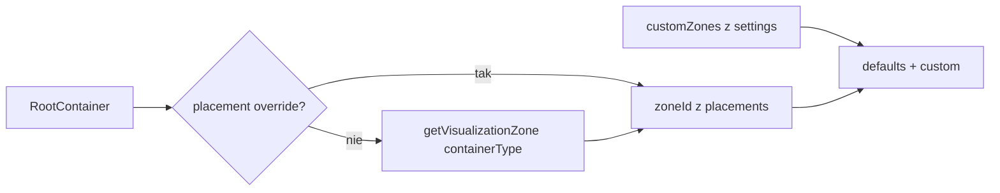

# Wizualizacja: DnD + własne obszary (DB)

**Status:** `done`  
**Date:** 2026-07-22

## Overview

Rozszerzenie wizualizacji kontenerów o drag-and-drop z trwałym override placementu oraz o własne obszary (nazwa + ikona). Dane zapisujemy w `gear_settings` (PostgreSQL + localStorage backup przez istniejący dual-path).

## Decyzje (ustalone)

- DnD zapisuje **override placementu** (`containerId → zoneId`), niezależnie od `containerType`
- Domyślne 4 strefy są **stałe** (bez edycji/usuwania); użytkownik może **tylko dodawać** własne (oraz edytować/usuwać własne)
- Persistencja: kolumny JSON w [`gear_settings`](../../backend/app/modules/gear_settings/db_models.py) przez `PATCH /me/gear-settings` (ten sam dual-path co dziś: API + localStorage backup w [`gearSettingsService.ts`](../../src/modules/gear/services/gearSettingsService.ts))

Dodatkowo: poprawka defaultu `trunk → vehicle` w mappingu typ→strefa (Bagażnik w Pojazd bez ręcznego przeciągania).

## Model danych

Rozszerzenie `IGearSettings` / `GearSettingsDB`:

```ts
interface IVisualizationCustomZone {
  id: string          // crypto.randomUUID() — brak paczki `ulid` we froncie; istniejąca konwencja dla nowych encji client-side to UUID (patrz gearItemLocalServiceV2.ts), nie ULID
  name: string
  iconKey: string     // klucz z allowlisty lucide (np. 'tent', 'ship')
  createdAt: string
  updatedAt: string
}

// w IGearSettings:
visualizationCustomZones: IVisualizationCustomZone[]
visualizationPlacements: Record<string, string>  // containerId → zoneId
```

Backend (camelCase w API, snake_case w DB):

- `visualization_custom_zones` JSON NOT NULL DEFAULT `'[]'`
- `visualization_placements` JSON NOT NULL DEFAULT `'{}'`

Migracja: `backend/migrations/056_add_visualization_to_gear_settings.py` — wzór jak **`053_add_missing_fields_to_v2.py`** (prawdziwe `ADD COLUMN ... JSON/JSONB` na istniejącej tabeli, z `table_exists`/`column_exists` guardami). *Korekta: `039` tworzy całą tabelę `gear_settings` od zera (CREATE TABLE), a `042` tylko zmienia typ/długość istniejącej kolumny varchar — żadna z nich nie jest realnym przykładem dodania kolumny JSON do istniejącej tabeli, `053` jest.*

⚠️ **Uwaga: `custom_categories`/`custom_container_types`/`custom_brands` to dziś jedyne kolumny JSON w `gear_settings` i wszystkie są listami obiektów** (`Mapped[list[dict]]`, `default=list`). `visualization_custom_zones` pasuje do tego wzorca 1:1. `visualization_placements` to natomiast **słownik** (`Record<string,string>`, `dict[str, str]`, `default=dict`) — pierwsza kolumna tego kształtu w module. Nie da się jej przepuścić przez istniejący, jednolity dla list-of-models mechanizm w `_map_to_response`/`update_settings` (`service.py`) ani przez generyczne helpery `addToArray`/`updateInArray`/`removeFromArray` we froncie (`gearSettingsService.ts`) — potrzebna osobna, dedykowana ścieżka (get/set/merge po `containerId`), nie tylko dopisanie klucza do istniejących union types.

Schema/service: [`schemas.py`](../../backend/app/modules/gear_settings/schemas.py), [`service.py`](../../backend/app/modules/gear_settings/service.py), [`db_models.py`](../../backend/app/modules/gear_settings/db_models.py) — dodać pola do Response/Update i mapowania.

## Logika stref



Pliki:

- [`visualizationZones.ts`](../../src/modules/gear/utils/visualizationZones.ts) — rozszerzyć:
  - `resolveZoneId(container, placements)` = override ?? type default (dziś istnieje tylko `getVisualizationZone(containerType)`, bez override — `resolveZoneId` to nowa funkcja, nie rozszerzenie istniejącej)
  - `ZONE_CONFIG` bez zmian semantycznych — *korekta: dziś ma **5** wpisów (`body`, `carry`, `vehicle`, `home`, `other`), nie 4; `DEFAULT_ZONE_IDS` jako nazwany eksport **nie istnieje dziś** i trzeba go dodać (albo wyprowadzić z kluczy `ZONE_CONFIG`)*
  - `getZoneIcon(iconKey)` z curated mapą (defaulty + ikony do pickera) — **uwaga:** `VisualizationZone.vue` ma dziś własną, zahardkodowaną mapę `ZONE_ICONS` (5 ikon dla defaultowych stref) — trzeba ją zastąpić/zreconcilować z nową `getZoneIcon`, żeby nie było dwóch źródeł prawdy dla ikon stref. Wzorować się na istniejącym `categoryIcons.ts` (`CATEGORY_ICONS` + `getCategoryIcon` z fallbackiem) — ten sam pattern już działa w projekcie.
  - `trunk: 'vehicle'` zamiast `'carry'`
- [`ContainerVisualizationPage.vue`](../../src/modules/gear/pages/ContainerVisualizationPage.vue) — buduje listę stref = defaulty (`ZONE_CONFIG`, obecnie 5) + `visualizationCustomZones`; grupuje root containers przez `resolveZoneId`. *Potwierdzone: strona już używa V2 (`useGearV2`, `IGearItemV2`, `useContainersWithChildren`) — brak side-questa V1→V2 przy tej zmianie.*

Przy usunięciu custom zone: wyczyść placementy wskazujące na jej `id` (fallback do type default). Orphan placementy (kontener usunięty) ignorowane przy renderze; opcjonalnie prune przy zapisie.

## Frontend settings layer

Rozszerzyć end-to-end (jak `customBrands`):

- typy: [`gearSettings.types.ts`](../../src/modules/gear/types/gearSettings.types.ts)
- store: [`useGearSettingsStore.ts`](../../src/modules/gear/store/useGearSettingsStore.ts) — state + sync w `updateSettings` / `loadFromStorage`
- local + API factory: [`gearSettingsService.ts`](../../src/modules/gear/services/gearSettingsService.ts)
- composable: [`useGearSettings.ts`](../../src/modules/gear/composables/useGearSettings.ts) — `setContainerZone(containerId, zoneId)`, `addCustomZone`, `updateCustomZone`, `removeCustomZone`

## UI / DnD

Bez nowej biblioteki — HTML5 Drag and Drop:

*Korekta: oba komponenty poniżej **już istnieją** i mają dziś statyczne, nie-DnD implementacje (`VisualizationContainerCard.vue` — 42 linie, karta z linkiem do detali; `VisualizationZone.vue` — 53 linie, własna mapa `ZONE_ICONS`). To zadanie to **rozszerzenie istniejących komponentów**, nie tworzenie nowych plików.*

- [`VisualizationContainerCard.vue`](../../src/modules/gear/components/visualization/VisualizationContainerCard.vue) — dodać `draggable`, `dragstart` z `containerId`
- [`VisualizationZone.vue`](../../src/modules/gear/components/visualization/VisualizationZone.vue) — dodać `dragover` / `drop`; highlight drop-target; zamienić lokalną `ZONE_ICONS` na `iconKey` (custom) lub `getZoneIcon` z `visualizationZones.ts`
- Dialog „Dodaj obszar”: nazwa + siatka ikon z allowlisty (~12–16 lucide, np. Tent, Ship, TentTree, Bike, Plane, Home, …)
- Przycisk „Dodaj obszar” na stronie wizualizacji; menu na custom zone: edytuj / usuń (defaulty bez menu)

Drop → `setContainerZone` → `PATCH` (optimistic update w store, potem API).

## i18n

Klucze w [`src/modules/gear/i18n/index.ts`](../../src/modules/gear/i18n/index.ts): add zone, edit/delete zone, empty drop hint, icon label, confirm delete.

## Testy

- Unit: `resolveZoneId` (override vs default), `trunk → vehicle`, usunięcie strefy czyści placementy
- Backend: smoke update/get nowych pól w gear_settings (jeśli są istniejące testy modułu — dodać; dziś brak dedykowanych testów)

## Docs

Krótki wpis w [`docs/ROADMAP_ONLINE.md`](../ROADMAP_ONLINE.md) przy ustawieniach użytkownika (feature online/DB) + ewentualnie status w [`docs/ROADMAP.md`](../ROADMAP.md) jeśli dodajemy do „Nadchodzące”.

## Implementation todos

1. Migracja 056 + rozszerzenie GearSettings DB/schemas/service (customZones + placements)
2. Typy, store, service dual-path, composable dla visualization settings
3. `resolveZoneId` + `trunk→vehicle` + ikony allowlisty w `visualizationZones.ts`
4. DnD na kartach/strefach + dialog tworzenia własnego obszaru (nazwa+ikona)
5. i18n PL/EN, unit testy resolve/placements, wpis w ROADMAP_ONLINE
